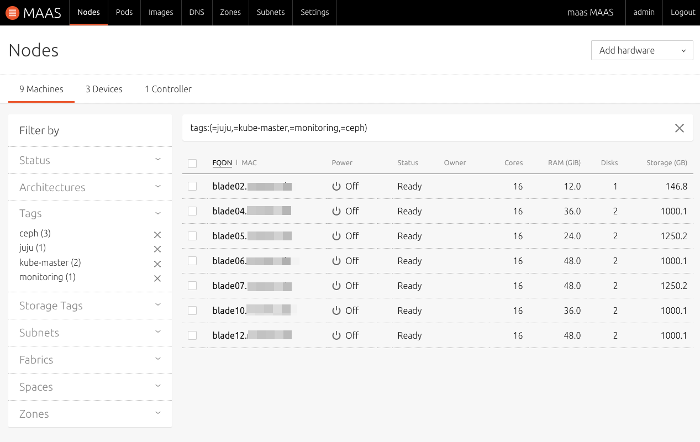
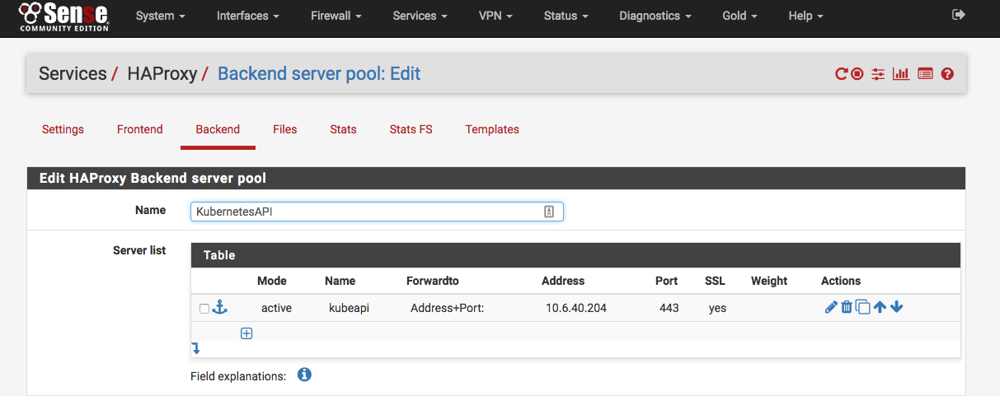
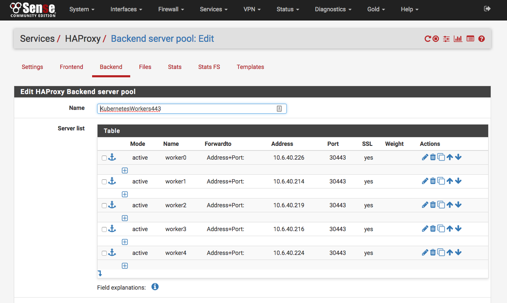

# Canonical Kubernetes on MAAS
##

Contents
--------

  * [Description](#markdown-header-description)
  * [Requirements](#markdown-header-requirements)
  * [Pre\-installation](#markdown-header-pre-installation)
    * [Prepare your MAAS](#markdown-header-prepare-your-maas)
    * [Install required tools](#markdown-header-install-required-tools)
    * [Clone this repo](#markdown-header-clone-this-repo)
  * [Installation](#markdown-header-installation)
    * [Bootstrap Juju controller](#markdown-header-bootstrap-juju-controller)
    * [Deploy bundle](#markdown-header-deploy-bundle)
    * [Update LXD profiles](#markdown-header-update-lxd-profiles)
    * [Create RBD pool in Ceph](#markdown-header-create-rbd-pool-in-ceph)
    * [Apply additional configuration to master and worker charms](#markdown-header-apply-additional-configuration-to-master-and-worker-charms)
    * [Setup monitoring applications](#markdown-header-setup-monitoring-applications)
  * [Post\-installation](#markdown-header-post-installation)
    * [Update HAproxy endpoints in pfSense](#markdown-header-update-haproxy-endpoints-in-pfsense)
    * [Kubernetes cluster setup](#markdown-header-kubernetes-cluster-setup)
  * [Useful links](#markdown-header-useful-links)


## Description
This document describes how to deploy Canonical Kubernetes cluster with Ceph storage and monitoring with Graylog/Prometheus using Juju into existing MAAS infrastructure. Cluster is designed for High Availability and includes three-machine etcd and three-machine ceph cluster, two Kubernetes masters with a loadbalancer and five Kubernetes workers.

 

MAAS in our setup is behind reverse-proxy in private network and will be exposed into public by use of HAProxy plugin for pfSense.

Current version of this deployment doesn't have RBAC enabled. Authentication is done by means of Basic Auth and tokens only. LDAP integration as well as fine-grained RBAC policies can be considered for future iterations.

Persistent volume claims are supported via default StorageClass, which is RBD (rados block device) pool running on top of Ceph cluster.

Post-installation steps include instructions on setting up some must-have applications for the cluster, like Helm, Nginx Ingress controller, Dashboard, ExternalDNS integrated with AWS Route53 and Cert-manager with automagical issue of Let's Encrypt certificates.

## Requirements
It's assumed that MAAS cluster can reach the outside world (eg. able to download updates), and there are at least 7 bare-metal servers commissioned and in Ready state. 

All commands in this documents should be executed from Ubuntu host that has direct network access to MAAS servers (eg. can ssh into them). You also need to be familiar with Juju deployments, as well as LXD containers. You can find more information in [Useful links](#useful-links) section.

## Pre-installation
### Prepare your MAAS
Juju bundle makes use of machine constraints for the deployment by matching tag constraints against existing MAAS tags. Therefore the first step is to login to your MAAS web console with admin credentials and tag machines with the following:
* '*juju*' - this is where Juju controller is installed. You can take the 'weakest' host with at least about 4 Gb of RAM and 50 Gb of disk space. You only need to tag one instance
* '*ceph*' - main requirement for these is that second attached disk should be unmounted in MAAS and disk capacity across all the machines should be similar. You need 3 instances tagged
* '*kube-master*' - this could be any 2 instances since masters don't really require much
* '*monitoring*' - this is for Graylog and Prometheus setup. Tag any existing server with at least 8 Gb of RAM

Kubernetes workers are spread over 'ceph' and 'kube-master' tagged nodes.

You also need to write down your admin MAAS API key that is needed for the next step.



### Install required tools
Prepare tools that are going to be used during this deployment. 
```
sudo snap install juju --classic
sudo snap install kubectl --classic
sudo snap install helm
```
### Clone this repo
Just clone this repo and move into its directory.

## Installation
### Bootstrap Juju controller
Update *maas-cloud.yaml* with appropriate endpoint and API key values to fit your existing MAAS setup.
Run the commands to add your MAAS infrastructure as cloud provider for Juju and bootstrap Juju controller in it.
```
juju add-cloud maas-cloud -f maas-cloud.yaml
juju add-credential maas-cloud -f maas-cloud.yaml
juju bootstrap maas-cloud maas-cloud-controller --constraints tags=juju
 ```
This can take up to 15 minutes to complete.
### Deploy bundle
Add Juju model for our deployment and execute the deploy command for the bundle.
```
juju add-model kubernetes-maas
juju deploy ./bundle.yaml
```
This can take about an hour. You can monitor the deployment status using this command:
```
watch --color juju status --color
```
### Update LXD profiles
Once most of the applications are up and running you might notice that Kubernetes workers stuck in 'waiting' state. This is because of LXD containers they are running in don't have required access to the underlying host resources. We need to grant containers an access by updating their LXD profile config and restarting them (I wish there was a way to put this config during host provisioning, but I couldn't find any).
```
./lxc-update.sh lxd-profile.yaml
```
After a while (about 10 minutes) all Kubernetes related applications should reach 'active' state. You can use previously mentioned command to check that.

Notice that `apache2` and `mongodb` workload state is stuck in 'unknown'. This is because current versions of these charms do not provide information about their state yet. Just ignore them.
### Create RBD pool in Ceph
Next we create RBD pool in our Ceph storage. It will be used as a default StorageClass for our Kubernetes cluster. To make these changes you need to ssh into one of the kubernetes-master nodes and execute the following commands:
```
juju ssh kubernetes-master/0
> ceph osd pool create rbd 100 100
> ceph osd pool application enable rbd rbd
> ceph osd crush tunables hammer
```
### Apply additional configuration to master and worker charms
We're almost there with Juju installation. There are some configs we need to adjust that are specific to our deployment.

1\. We need to open ports on each instance of kubernetes-worker. These ports are NodePorts in Kubernetes terms. During HAProxy setup we will setup forwarding of these ports to the public as http/https ports. 
```
juju run --application kubernetes-worker open-port 30080/tcp
juju run --application kubernetes-worker open-port 30443/tcp
```
2\. Your Kubernetes API servers run behind the loadbalancer secured with TLS. We need to update SAN entries for this loadbalancer so it would be possible to call API by some external URL.
```
juju config kubeapi-load-balancer extra_sans=<< Your Kubernetes API URL >>
```
3\. And finally, add Kubernetes Admission controllers, primarily for automatic storage provisioning, but there are more here, which are the recommendations.
```
juju config kubernetes-master api-extra-args="admission-control=NamespaceLifecycle,LimitRanger,ServiceAccount,PersistentVolumeLabel,DefaultStorageClass,DefaultTolerationSeconds,MutatingAdmissionWebhook,ValidatingAdmissionWebhook,ResourceQuota"
```
### Setup monitoring applications
Head into *monitoring* directory and run
```
chmod 700 config.sh
./config.sh
```
The script applies all necessary configurations to Prometheus/Grafana as well as Graylog. On completion it reports information about Web UI endpoints and how to get passwords to access those endpoints. Make sure to write them down.
## Post-installation
### Update HAproxy endpoints in pfSense
This task assumes that you use pfSense with HAProxy for managing routing. Main idea is to forward our API and worker endpoints to listen on a specified publicly available IP.

Get all the necessary backend endpoints:
```
echo API loadbalancer:; juju status | awk '$1 ~ /kubeapi-load-balancer\// {print $5,$6}'
echo Kubernetes workers:; juju status | awk '$1 ~ /kubernetes-worker\// {print $5,$6}'
```
Go to your pfSense web interface, navigate to `Services` -> `HAProxy` -> `Backend` and update *KubernetesAPI*, *KubernetesWorkers80* and *KubernetesWorkers443* entries in accordance with obtained endpoints.





Find more information on how to set up HAProxy in [Useful links](#useful-links) section.

### Kubernetes cluster setup
At this point you should have a fully set-up and running Kubernetes cluster that is available publicly. Get credentials for kubectl and let's apply some final small but important touches.
```
juju scp kubernetes-master/0:config ~/.kube/config
```
1\. Default storageClass. Get endpoints for Ceph monitors and update *rbd-storage.yaml* with these IP addresses
```
echo Ceph monitors:; juju status | awk '$1 ~ /ceph-mon\// {print $5}'
# put your IP's in rbd-storage.yaml
kubectl create -f kubernetes/rbd-storage.yaml
```
2\. Install Helm Tiller. Make sure that your KUBECONFIG environment variable points to previously downloaded kubectl config
```
helm init
```
3\. Install Kubernetes Dashboard with Heapster (for fancy graphs)
```
helm install stable/heapster --name heapster --namespace kube-system
helm install stable/kubernetes-dashboard --name kubernetes-dashboard --namespace kube-system
```
4\. Update `externalIPs` with your values and install Nginx Ingress controller
```
helm install stable/nginx-ingress --values kubernetes/nginx-values.yaml --name nginx-ingress --namespace kube-system
```
5\. Install ExternalDNS to manage your AWS Route53 records. It's assumed that you already have user in AWS with policies allowing to manage Route53 resources. Update credentials in *external-dns-values.yaml* and the rest of lines according to your needs before installation.
```
helm install stable/external-dns --values kubernetes/external-dns-values.yaml --name external-dns --namespace kube-system
```
6\. Install Cert-manager for automatic and manual certificate issuance. Populate it with Let's Encrypt config. For DNS01 challenge to work it requires credentials for user with Route53 manage access, similar to ExternalDNS 
```
helm install stable/cert-manager --values kubernetes/cert-manager-values.yaml --name cert-manager --namespace kube-system
kubectl create -f kubernetes/letsencrypt.yaml
```
7\. To validate that Nginx, ExternalDNS and Cert-manager are setup properly deploy test echoserver application
```
kubectl create -f examples/echoserver.yaml
```
After a while you should be able to access it publicly from [https://echoserver.example.com](https://echoserver.example.com)

## Useful links
* https://kubernetes.io/docs/getting-started-guides/ubuntu/
* https://github.com/juju-solutions/bundle-canonical-kubernetes/wiki
* https://github.com/PiBa-NL/pfsense-haproxy-package-doc/wiki
* https://medium.com/@kwmonroe/monitor-your-kubernetes-cluster-a856d2603ec3
* https://github.com/conjure-up/spells/blob/master/canonical-kubernetes/addons/
* https://github.com/CalvinHartwell/canonical-kubernetes-demos/tree/master/cdk-logging-and-monitoring
* https://github.com/CalvinHartwell/canonical-kubernetes-demos/tree/master/cdk-ceph
